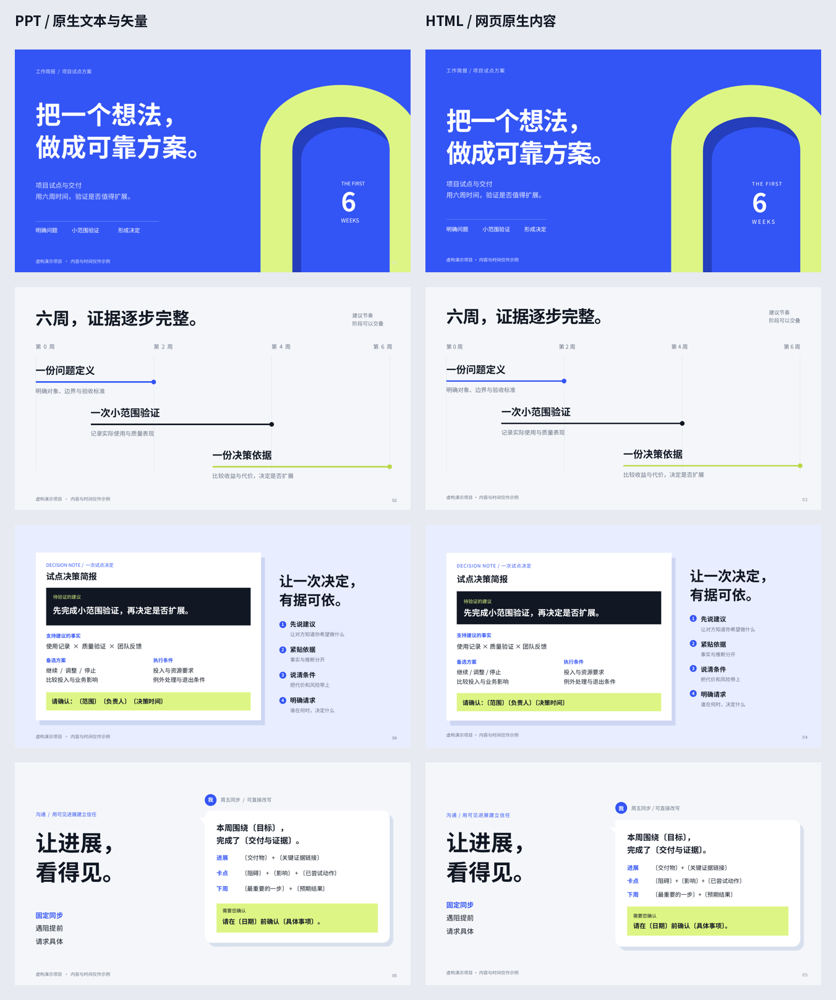

# PPT / HTML

同一套审美，两条原生交付链路。先把材料编辑成美观、凝练、精简的作品，再交付用户需要的文件。

仓库名称：`ppt-html`。当前版本基于 PPT Agent v7.3，保留调用入口 `$ppt-agent-v7`，完整流程见 [SKILL.md](SKILL.md)。

## 默认 PPT，明确要求时交付 HTML

| 用户要求 | 最终交付 |
| --- | --- |
| 做演示 / 做 PPT / 没说格式 | 可编辑 PPTX、逐页 SVG、实际 PPT 预览 |
| HTML / 网页演示 / 用 HTML 展示 PPT | 离线单文件 HTML、实际网页预览 |
| PPT 和 HTML 都要 | 同一内容与视觉方向的两种原生成品 |

网页只是材料或参考，不会让交付自动切成 HTML。修改已有稿件时延续其格式；明确改格式时按新要求制作。HTML 文件的交付不自动发布网站。

## 固定可观察的视觉标准

本版将已经成立的视觉方向变成默认基准：编辑式排版、鲜明的主次、具体的工作对象、有效的空间层次和有意义的整套节奏。参考内容为重新编写的虚构示例，不包含个人或公司资料。



- [默认视觉基准](references/approved-style.md)：什么保持稳定，什么按内容变化。
- [共用参数](assets/approved-style/tokens.json)：配色、字体、边距和字号比例。
- [成对源稿](assets/approved-style/reference/deck.json)：六页 SVG 与 HTML，可直接查看和改写。
- [整体审美方法](references/aesthetic-method.md)：从艺术意图、内容构图、视觉语法到整套节奏。

每次按新内容决定页面与构图，不能把所有任务套成六页模板，或所有封面都画同一个拱门。新品牌和明确参考优先。基准、主视觉页、复杂内页与实际成品必须并排检查，技术通过不代表美感成立。

## 两条链路

**PPT**：SVG 真文字和图形，编译成 PowerPoint 原生文本、曲线、形状与分组。用 JavaScript artifact-tool 或公开的 PptxGenJS 创建容器，检查最终 PPT 的实际渲染。整页图片、文字轮廓和插入 SVG 图片不能冒充原生可编辑。

**HTML**：DOM 文字、CSS 排版和内联 SVG，打包字体、许可、样式、脚本和备注。桌面保持 16:9 画面，手机重排；带目录、键盘与触控翻页、备注、文字编辑和保存副本。结构与图形可以在源码中修改。

两种同时交付时共享事实、页序、结论、备注和视觉决策，各自制作原生源稿；不声称能将任意 HTML 自动无损转成可编辑 PPT。

## 调用

> 用 $ppt-agent-v7 根据我的材料做一份演示，沿用默认视觉基准。

> 用 $ppt-agent-v7 做一份 HTML 演示，沿用默认视觉基准。

> 用 $ppt-agent-v7 做一份演示，PPT 和 HTML 都要。

将本仓库目录作为 `ppt-agent-v7` 安装到支持技能的环境。ChatGPT 个人技能应通过该环境的技能保存流程安装，临时文件夹中的代码不等于已启用的技能。

## 构建与验收

按 [项目说明](references/project.md) 准备 deck.json 及请求格式的源稿。不写 `deliverables` 字段默认 PPT；HTML 用 `["html"]`；两种都要用 `["pptx", "html"]`。

```bash
python3 scripts/presentation.py route /absolute/project
python3 scripts/presentation.py build /absolute/project
```

PPT 所需环境与字体准备见 [runtime.md](references/runtime.md)，HTML 见 [html-delivery.md](references/html-delivery.md)。HTML 分支不需要 LibreOffice。浏览器渲染会记录文字边界、网络依赖、键盘、目录、备注、编辑下载重开和手机翻页检查，视觉效果仍需实际查看。

```bash
node scripts/render_html.mjs /absolute/project
python3 scripts/deck.py approve /absolute/project --note "实际 PPT 的内容、构图检查结果"
python3 scripts/html_deck.py approve /absolute/project --note "实际网页与手机画面的检查结果"
```

只运行请求分支的渲染和 approve；approve 是作者的审阅记录，不要求用户审批。源稿改变后旧记录失效。

## 边界

- 矢量图表默认形状级编辑，不包含 Excel 数据表；有数据表需求时使用原生图表 API。
- 照片与截图保留其真实编辑方式，不能称为全矢量。
- PPT 在另一台设备保持排版，需要安装源稿包中的开放字体。HTML 内嵌当前文案的字体子集；新输入字形可能暂用系统字体，重新构建可补齐。
- 验证环境为 Linux LibreOffice 与 Chromium，未声称逐一验证所有 PowerPoint、WPS 和移动浏览器。
- 风格基准减少漂移；不同内容仍需要设计判断，不能靠固定配额或自动审美评分保证质量。

技能完整性检查：`python3 scripts/check_skill.py`。公开示例都是虚构演示数据。
