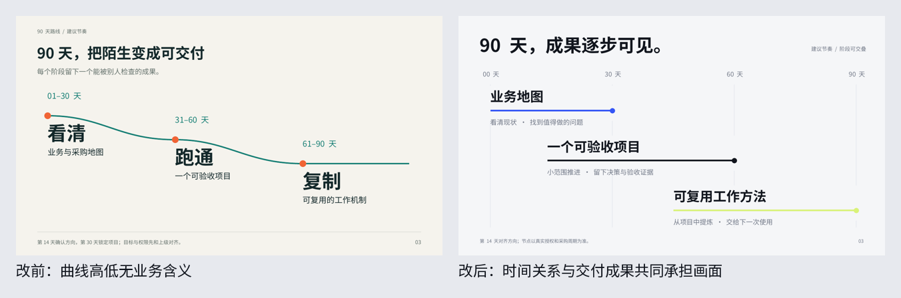

# PPT Agent v7.2

Version 7.2 adds a transferable [aesthetic decision method](references/aesthetic-method.md): connect viewing context and artistic intent, translate content relationships into composition, establish a visual grammar, shape the rhythm of the deck, and calibrate through actual rendered work.

Review at three scales: the deck, normal viewing size, and local detail. Refine an approved direction; explore alternatives when the direction is unresolved. Keep visual prototypes and editable studies without treating any palette, layout, or density as a universal style.

See the [visual studies](references/visual-studies.md) for actual editable examples and design tradeoffs. They are generic exercises, not a default theme or a claim of user approval.




Create clear, concise, visually considered presentations with editable PPTX, per-slide SVG sources, and previews rendered from the actual PPTX.

Install this repository as a skill named `ppt-agent-v7`. Start at [SKILL.md](SKILL.md) and use `$ppt-agent-v7`.

## Workflow

1. Edit the material: identify the audience, claim, evidence and necessary qualifications. Let the content determine the slide count.
2. Establish an art direction: when redesigning an ordinary result or when direction is unresolved, render two meaningfully different compositions using the same facts.
3. Build editable vector pages: text stays text; shapes and semantic groups remain native PowerPoint objects.
4. Inspect the actual export: review visual hierarchy, typography, clarity and unnecessary content, then verify file structure and fidelity.

The [70 principles](references/principles.md) are optional design references, not a mandatory form. Fixed interviews, decoration quotas, compulsory layout rotation and rigid multi-agent stages are no longer part of the active workflow.

## Runtime

Run `python3 scripts/doctor.py` from the skill directory. A managed Codex runtime is used when available. A regular Linux environment needs Python 3.10+, Node.js 22+, LibreOffice, Poppler and fontconfig, plus the Python/npm dependencies supplied with the skill. The public fallback container uses PptxGenJS; native DrawingML compilation remains the same.

See [runtime.md](references/runtime.md) for setup and compatibility and [project.md](references/project.md) for project structure.

```bash
python3 scripts/fonts.py --ensure
python3 scripts/deck.py build /absolute/path/to/project
python3 scripts/check_skill.py
python3 scripts/smoke_skill.py
```

Inspect the actual rendered pages before recording the review with `deck.py approve`. The command records an agent's inspection; it is not an aesthetic score or user permission prompt.

Outputs are `presentation.pptx`, `svg-source.zip` and `preview.png`. Source packages include the manifest, SVG pages and eligible open fonts/licenses. Incremental builds preserve unaffected pages; changing the rendering engine invalidates previous caches and review records.

## Scope

Charts are editable shapes, not Excel-backed native charts. The included compiler uses an all-vector path; photographic tasks require a suitable authoring tool and accurate disclosure. Linux is the validation environment; native Windows, macOS and every PowerPoint version are not claimed as tested.

This independent repository includes the v7.2 workflow; the invocation name remains `ppt-agent-v7`. Examples use clearly labeled fictional data.
